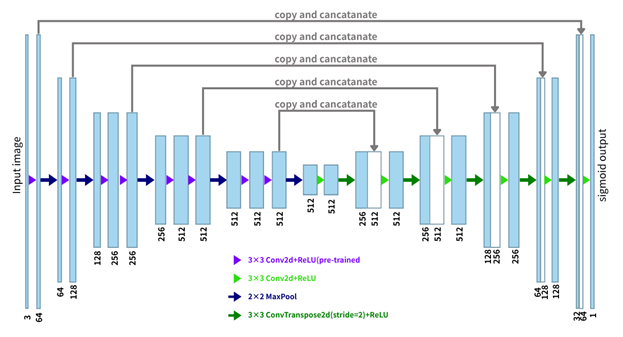
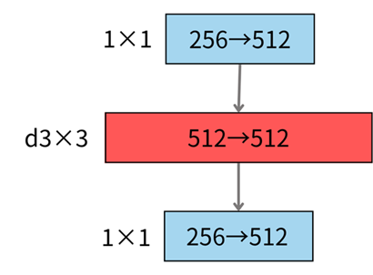
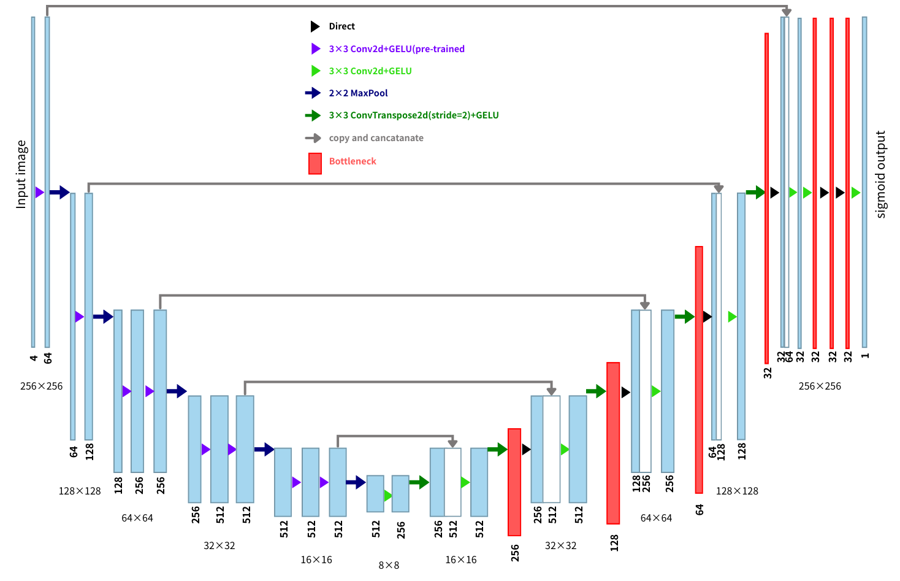
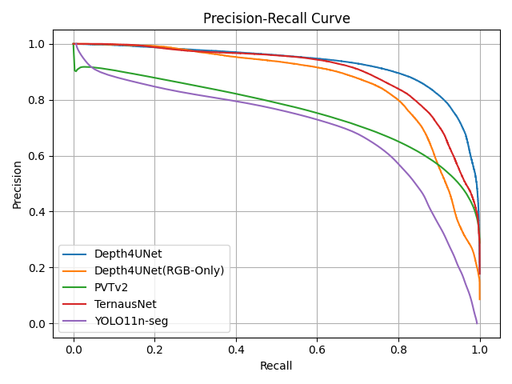

# Depth4UNet: UAV Aerial Image Semantic Segmentation with Monocular Depth Estimation and Multi-Scale Feature Fusion

## Overview
Depth4UNet is a semantic segmentation architecture for UAV aerial imagery.  
It integrates **RGB images** with **monocular depth estimation**, forming a **four-channel input (RGB-D)**.  
This enables the model to simultaneously learn **appearance** and **geometric features**, improving the recognition of visually similar land-cover types such as grass, buildings, and water.  

The backbone is **TernausNet (VGG11 encoder)**, extended with:
- A **depth-guided decoder**  
- **Inverted bottleneck modules**  
- **Multi-scale tiling strategy** for high-resolution UAV images  

Experiments show Depth4UNet outperforms baseline models on **AP, F1-score, and mIoU**.  
- AP: **0.9430**  
- F1-score: **0.8757**  
- mIoU: **0.7775**

---

## Features
- Four-channel input (RGB + Depth)  
- Depth-guided skip connections for boundary recovery  
- Inverted bottleneck and SE modules for efficient multi-scale feature fusion  
- Multi-scale tiling for large UAV images  
- State-of-the-art performance on the Inria Aerial Image Labeling Dataset  

---

## Architecture

### Monocular Depth Estimation
- Preprocessing with CLAHE, Gamma correction, bilateral/gaussian filters  
- Multi-scale Gabor filters for texture features  
- Shadow removal via HSV/LAB space  
- FFT for frequency features  
- Sobel gradient consistency checks  
- Canny edge preservation during depth fusion  

### Results
<p align="center">
  
  
  
</p>

<p align="center">
  <em>Figure 1: Monocular depth estimation pipeline results showing original aerial image, estimated depth map, and semantic segmentation output.</em>
</p>

---

### TernausNet Backbone
- Based on U-Net encoder-decoder  
- Pretrained VGG11 encoder  
- Enhanced with skip connections  

  

---

### Inverted Bottleneck
- Expansion → Depthwise convolution → Compression  
- Captures multi-scale context with efficiency  

  

---

### Depth4UNet Architecture
- Four-channel input  
- Depth-guided decoder  
- Multi-branch multi-scale bottleneck (standard conv, dilated convs, global pooling)  
- GELU activation for smooth gradients  

  

---

## Experiments

- **Dataset**: Inria Aerial Image Labeling Dataset (5000×5000 px)  
- **Training**: 100 epochs, batch size 4, input size 256×256  
- **Evaluation Metrics**: Precision, Recall, F1-score, mAP, mIoU  

  

**Table 2: Comparison of segmentation metrics across models**  

| Model              | AP     | F1-score | mIoU  |
|--------------------|--------|----------|-------|
| PVTv2              | 0.8571 | 0.7947   | 0.6673|
| YOLO11n-seg        | 0.7716 | 0.8674   | 0.7658|
| Depth4UNet (RGB)   | 0.8626 | 0.7999   | 0.6666|
| TernausNet+Depth   | 0.8797 | 0.8102   | 0.6805|
| Depth4UNet (RGB-D) | 0.9430 | 0.8757   | 0.7775|  

---

## Results
- Depth4UNet (RGB-D) significantly outperforms RGB-only models  
- Depth channel provides +0.0804 AP, +0.0758 F1, +0.1109 mIoU boost  
- Best balance of precision and recall across all thresholds  
- Strong boundary recovery and robustness to texture similarity  

---

## Conclusion
Depth4UNet effectively combines **monocular depth estimation** and **multi-scale feature fusion** to enhance UAV aerial image segmentation.  
It reduces the need for manual annotation, achieves superior accuracy, and is well-suited for **UAV navigation, mapping, and remote sensing applications**.  

---

## Citation
If you use this work, please cite:

```bibtex
@article{Depth4UNet2025,
  title   = {Depth4UNet: UAV Aerial Image Semantic Segmentation with Monocular Depth Estimation and Multi-Scale Feature Fusion},
  author  = {Yao-Chung Chen and Yu-Hsiang Siang},
  year    = {2025},
  journal = {Inria Aerial Image Labeling Experiments},
}
```

---

## Figures to Insert
1. Figure 1 – Monocular depth estimation pipeline  
2. Figure 2 – TernausNet backbone  
3. Figure 3 – Inverted bottleneck module  
4. Figure 4 – Depth4UNet architecture  
5. Figure 6 – Precision-Recall curves comparison  
6. Table 2 – Metrics comparison across models  
